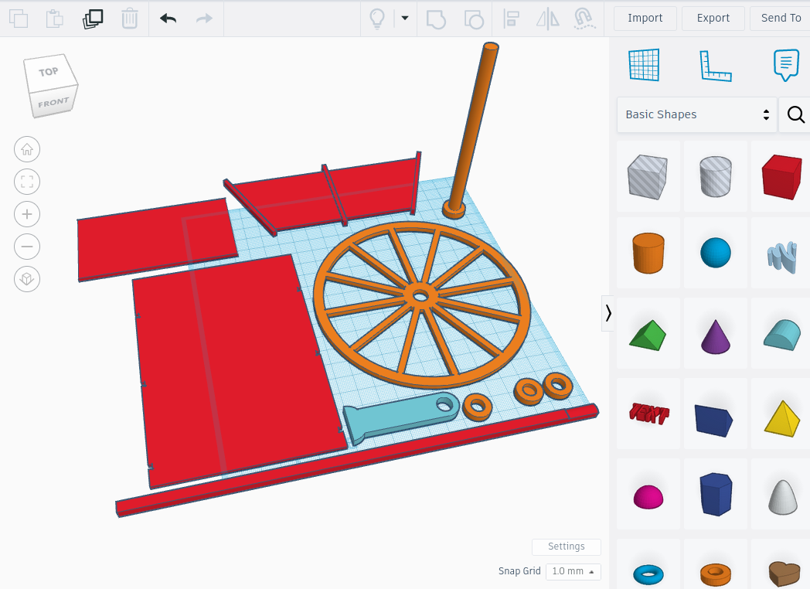
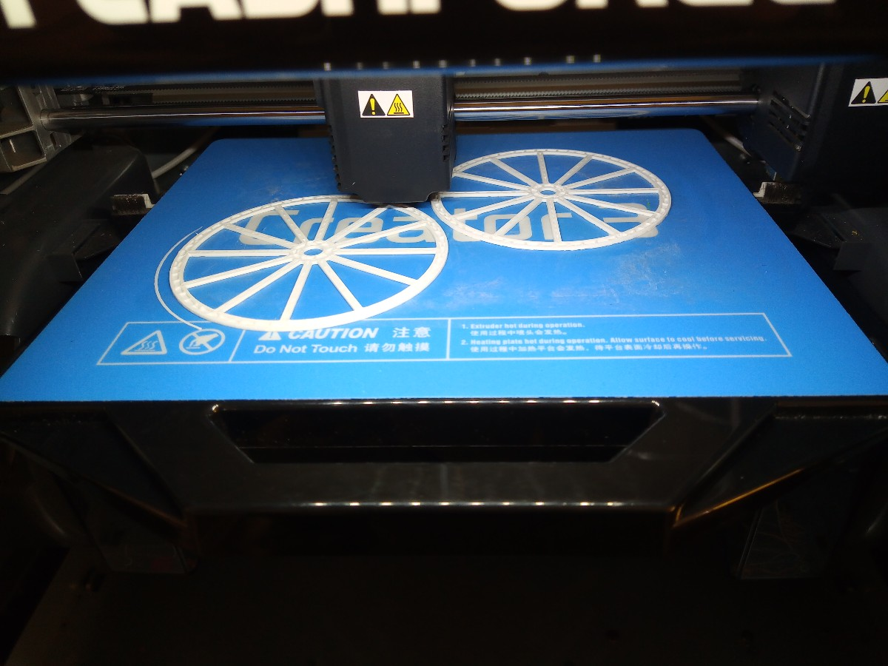
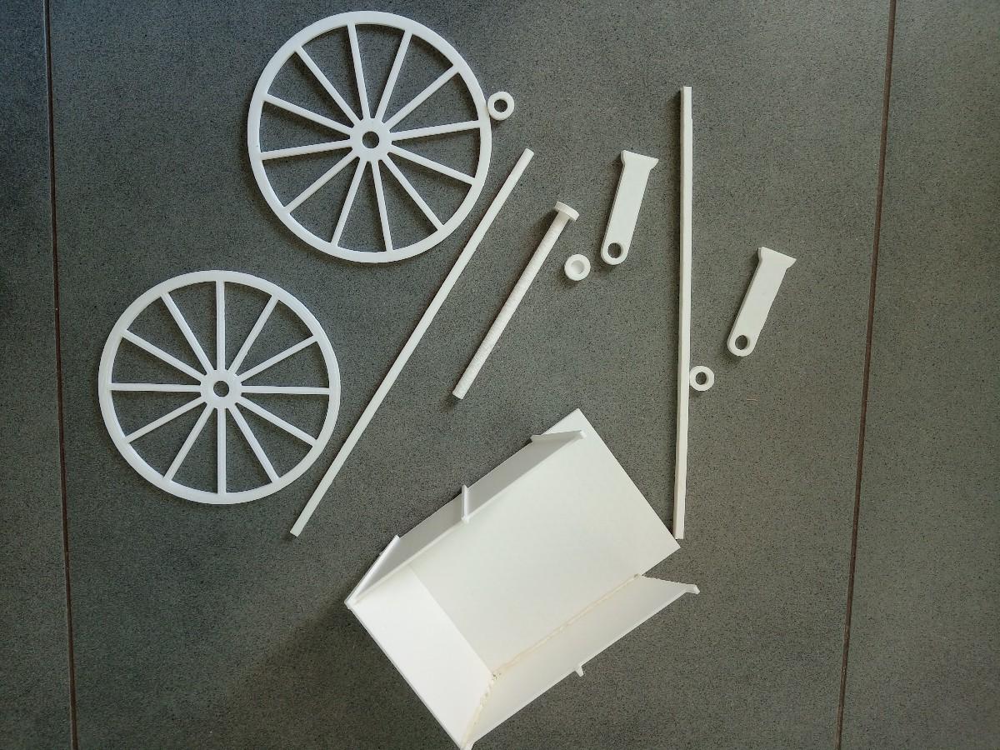
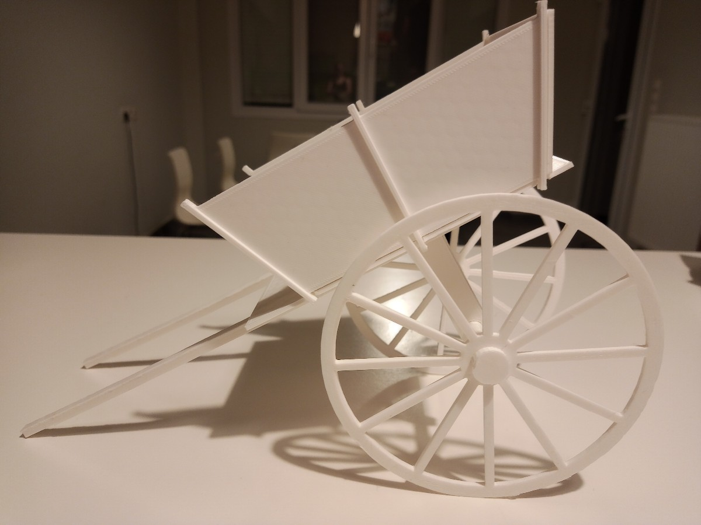
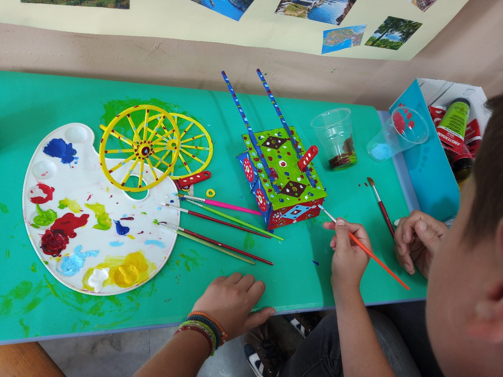

# Σικελικό κάρο

Το [Carretto Sicilianο](https://it.wikipedia.org/wiki/Carretto_siciliano), όπως ονομάζεται στα ιταλικά, είναι ένα περίτεχνο και πολύχρωμο κάρο χαρακτηριστικό της Σικελίας που χρησιμοποιούνταν για μεταφορά αγαθών προς πώληση, συνήθως κηπευτικών ή ψαριών. Τα κάρα αυτά είναι πλέον κομμάτι της παράδοσης της περιοχής και βρίσκονται σε λαογραφικά μουσεία.

Προκειμένου να σχεδιάσουμε και να εκτυπώσουμε ένα 3D μοντέλο τέτοιου κάρου μελετάμε αρχικά την κατασκευή και τα μέρη από τα οποία αποτελείται. Έχοντας υπόψη τους περιορισμούς της 3D εκτύπωσης (αποφυγή μεγάλων κενών, απότομων γωνιών, μερών σε ύψος χωρίς επαρκή υποκείμενη στήριξη κλπ.), παρατηρούμε ότι προκειμένου να το εκτυπώσουμε, θα πρέπει να χωρίσουμε την κατασκευή σε διακριτά μέρη τα οποία θα εκτυπωθούν ξεχωριστά στο επίπεδο και στη συνέχεια θα συναρμολογηθούν.

Τα μέρη αυτά φαίνονται στην παρακάτω εικόνα, όπως έχουν σχεδιαστεί με το λογισμικό [Tinkercad](https://www.tinkercad.com).

## Εκτύπωση

Κάποια από τα μέρη πρέπει να εκτυπωθούν παραπάνω φορές, συγκεκριμένα:
* 2 x Ρόδα
* 2 x Χειρολαβή
* 2 x Πλαϊνό
* 1 x Άξονας
* 2 x Στηρίγματα άξονα
* 2 x Πλαινό 
* 1 x Μπροστά πλευρά
* 1 x Καπάκι άξονα
  

|  |  |
|:----------------------------------:|:------------------------------------:|

## Συναρμολόγηση

Τα μέρη συναρμολογούνται και όπου χρειάζεται κολλάμε με κόλλα.

## Βάψιμο

Τελευταίο στάδιο είναι η διακόσμηση του κάρου με πολύχρωμα γεωμετρικά σχέδια.

|  |  |
|:----------------------------------:|:------------------------------------:|

Η διάθεση του έργου αυτού γίνεται με άδεια Creative Commons Αναφορά Δημιουργού - Μη Εμπορική Χρήση - Παρόμοια Διανομή 3.0 Ελλάδα (CC BY-NC-SA 3.0 GR).
